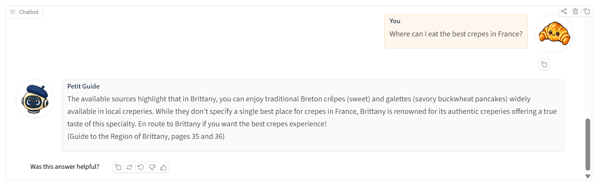
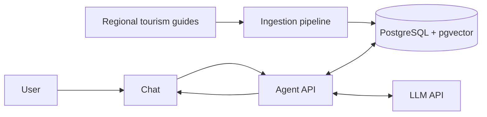

# _Bon Voyage_ - AI travel assistant

[](https://github.com/QuentinElGuay/portfolio-ai-tour-guide/releases)

_Salut! Je suis **Petit Guide**_, Bon Voyage’s AI travel assistant for French
destinations covered by indexed regional tourism guides. My job is to help you prepare
your visit in France by answering your questions using **Retrieval-Augmented Generation
(RAG)** based on regional tourism guides.


## Table of contents

- [Overview](#overview)
- [Question scope](#question-scope)
- [Architecture](#architecture)
- [Tech stack](#tech-stack)
- [Prerequisites](#prerequisites)
- [Quick start](#quick-start)
- [Common commands](#common-commands)
- [Airflow ingestion](#airflow-ingestion)
- [Evaluation](#evaluation)
- [Documentation](#documentation)
- [Data source](#data-source)
- [Roadmap](#roadmap)
- [Capstone success criteria](#capstone-success-criteria)
- [Contributing](#contributing)
- [License](#license)

## Overview

Created as a capstone project for the
[LLM Zoomcamp](https://github.com/DataTalksClub/llm-zoomcamp) by
[DataTalks.Club](https://datatalks.club), this project turns French regional tourism
guides into a question-answering experience that helps travellers plan their trips.



### Project goals

The project is designed as a focused portfolio demonstration of the full RAG workflow:

- Document ingestion
- Retrieval and prompt construction
- LLM integration
- A browser chat interface

The project also focuses on the practices that make RAG applications reliable:

- Keeping answers grounded in retrieved context
- Validating citations
- Evaluating retrieval and answer quality
- Adding guardrails for unsupported or overly specific questions

## Question scope

The project supports English questions about the French destinations covered by the
indexed regional guides. Topics include geography and natural landscapes, climate,
transport, outdoor recreation, history and heritage, culture, food, festivals, and local
life.

The assistant can list the destinations it covers from the titles of the documents
currently indexed in the knowledge base. This catalog is the only information it may
answer without retrieved passages; destination-specific advice and every other detailed
question must be grounded in retrieved context.

Supported examples:

- ✅ “Which destinations do you cover?”
- ✅ “What are the main places to visit in Normandy?”
- ✅ “What should I see in Occitanie?”

Unsupported questions include:

- ❌ “What are the best places to visit in Corsica?” — a destination not covered by the
  guides.
- ❌ “What is the weather in Paris today?” — current information absent from the guides.
- ❌ “Can you book a hotel in Saint-Malo for this weekend?” — booking, availability, or
  reservation requests.
- ❌ “Should I invest in renewable-energy stocks?” — an unrelated finance topic.
- ❌ “How does quantum entanglement work?” — an unrelated science topic.

> [!NOTE]
> English is the only supported language. This keeps the demonstration lightweight and
> suitable for a smaller model.

## Architecture

The project is divided into two workflows. The ingestion workflow processes the guides
into searchable passages (_chunks_), creates vector embeddings, and stores them in
PostgreSQL with pgvector. The application dynamically selects the strongest available
execution mode: LLM plus RAG, LLM conversational mode, deterministic retrieval, or
prepared deterministic questions. The chat interface and CLI share this capability
resolution.



## Tech stack

- **Language:** Python 3.14
- **Agent API:** FastAPI and Uvicorn
- **Chat interface:** Gradio
- **Embeddings:** FastEmbed
- **Storage and retrieval:** PostgreSQL with pgvector
- **Containerization:** Docker Compose
- **Agent workflow:** LangGraph
- **Ingestion orchestration:** Apache Airflow
- **Monitoring and evaluation:** Metabase

## Project structure

The main application lives in `src/ai_tour_guide/`, with ingestion, knowledge-base,
agent, LLM, and chat components. The repository also contains `evaluation/` workflows,
`airflow/` DAGs, `tests/`, `fixtures/`, `scripts/`, and `tools/`. Docker and local
development configuration is defined in `docker/`, `docker-compose.yml`, `Makefile`,
`.env.template`, and `pyproject.toml`. See the [documentation](#documentation) for
component-specific guides.

## Prerequisites

The recommended workflow requires _Git_, _Docker_ with _Docker Compose_, and _GNU Make_.

For direct Python commands, install _Python 3.14_ or newer and
_[uv](https://docs.astral.sh/uv/)_. _GitHub Codespaces_ can run the project without
local installation.

## Quick start

_This is a quick start aiming for an immediate setup. For the full tutorial, see the
[project tutorial](docs/README.md)._

### App configuration

With Docker, Docker Compose, and GNU Make installed, clone the project and change into
its directory, or open it in a GitHub Codespace.

> [!WARNING]
> As of September 8, 2026, we observed a possible Docker networking problem in GitHub
> Codespaces that prevented database initialization or document ingestion. The same
> commands worked locally, but recreating a Codespace did not reliably resolve the
> issue.

Start by creating a local environment file and choosing the LLM provider for the
application. First, create a `.env` file from the provided `.env.template` file:

```bash
cp .env.template .env
```

Replace the LLM settings in your `.env` file. Accepted `AGENT_LLM_PROVIDER` values are
`openai`, `gemini`, and `baguette-llm`.

> [!NOTE]
> The built-in `baguette-llm` is a deterministic demo provider, not a real LLM, and does
> not require an API key.

OpenAI example:

```dotenv
AGENT_LLM_PROVIDER=openai
AGENT_LLM_API_KEY=your-api-key
AGENT_LLM_MODEL=gpt-4.1-mini
```

### Knowledge-base ingestion

With the application configured, prepare the knowledge base before starting the
services.

Initialize the database schema, then ingest the knowledge base. These commands may take
a few minutes on the first execution to download Docker images and the embedding model:

```bash
make db-init
make ingest
```

> [!NOTE]
> `make ingest` is the fast command-line shortcut to ingest data into your knowledge
> base. For the recommended orchestrated workflow, use Airflow.
>
> The use of Airflow is detailed in the [tutorial](docs/README.md).

### App execution

Once the knowledge base is ready, start the agent API and chat interface:

```bash
make app
```

`make app` starts the agent service and the chat interface to communicate with it. Once
they are running, you can access the chat app at
[http://localhost:7860](http://localhost:7860)

## Common commands

These are the commands used most often during local development:

| Command             | Description                                         |
| ------------------- | --------------------------------------------------- |
| `make db-init`      | Initialize the pgvector application schema.         |
| `make ingest`       | Ingest the documents in `source_files.json`.        |
| `make app`          | Start the app API and Gradio chat interface.        |
| `make airflow`      | Start Airflow for parameterized ingestion.          |
| `make evaluate`     | Run the full evaluation suite.                      |
| `make dashboard`    | Start and initialize PostgreSQL and Metabase.       |
| `make simulate-rag` | Add synthetic traffic to the monitoring dashboards. |
| `make stop`         | Stop the running Compose services.                  |

For every command, its options, and operational cautions, see the
[Make command reference](docs/commands.md). `make help` remains the short terminal
reference. The [tutorial](docs/README.md),
[ingestion guide](src/ai_tour_guide/ingestion/README.md), and
[agent guide](src/ai_tour_guide/app/agent/README.md) cover the related workflows in
detail.

## Airflow ingestion

Airflow is the recommended ingestion workflow for orchestrating document processing.
Follow the [tutorial](docs/README.md#231-ingest-guides-with-airflow) for setup, DAG
triggering, retries, and re-ingestion options. For a faster local setup, use
`make db-init` followed by `make ingest` as described in the
[quick start](#quick-start).

## Evaluation

The project evaluates retrieval and the RAG pipeline with a 105-case golden dataset and
stores evaluation data in an isolated `evaluation` schema. The available search, RAG,
and judge workflows are documented in the [tutorial](docs/README.md#6-evaluation), with
the latest reports retained in the evaluation notebooks.

| Evaluation | Run                    | Purpose                                                                          |
| ---------- | ---------------------- | -------------------------------------------------------------------------------- |
| Search     | `make evaluate-search` | Compare the current vector, full-text, and hybrid retrieval quality.             |
| RAG        | `make evaluate-rag`    | Measure retrieval, citation, refusal, and latency metrics without the LLM judge. |
| Judge      | `make evaluate-judge`  | Add LLM-judge answer-correctness scoring; this makes additional model calls.     |

## Documentation

- [Ingestion guide](src/ai_tour_guide/ingestion/README.md): document definitions,
  pipeline stages, artifacts, and ingestion configuration.
- [Agent guide](src/ai_tour_guide/app/agent/README.md): RAG flow, CLI, HTTP API, and
  agent configuration.
- [Chat guide](src/ai_tour_guide/app/chat/README.md): Gradio service and its HTTP
  integration.
- [Make command reference](docs/commands.md): every project command, its options, and
  its operational cautions.
- [Tutorial](docs/README.md): end-to-end walkthrough for ingestion, chat, evaluation,
  and monitoring.
- [Troubleshooting](docs/README.md#5-troubleshooting): common setup and Docker fixes
  issues.
- [Roadmap](ROADMAP.md): delivered work and planned validation, evaluation, and
  monitoring.

## Data source

The project indexes the freely available French regional guides listed in
[`source_files.json`](source_files.json), published by
[Ibanista](https://www.ibanista.com/). They are used for educational purposes only and
are not redistributed in this repository.

## Roadmap

The complete plan, delivered milestones, release notes, and follow-up work are
maintained in the [roadmap](ROADMAP.md) and [release notes](docs/releases/).

### Capstone success criteria

The project follows the
[LLM Zoomcamp capstone evaluation criteria](https://github.com/DataTalksClub/llm-zoomcamp/blob/main/project.md#evaluation-criteria).

**A complete submission should demonstrate the following features:**

- A clearly defined problem, target users, supported questions, and limitations.
  - ✅ The [question scope](#question-scope) defines the travel-planning use case,
    intended questions, covered destinations, and explicit limitations.
- An accessible source dataset and reproducible instructions for running the project.
  - ✅ [`source_files.json`](source_files.json) identifies the public source guides, and
    the [quick start](#quick-start) documents the Docker-based local workflow.
- Automated ingestion from source documents into a searchable knowledge base.
  - ✅ The ingestion CLI and
    [Airflow workflow](docs/README.md#231-ingest-guides-with-airflow) download, parse,
    chunk, embed, and store the guides in PostgreSQL with pgvector.
- A RAG flow that retrieves relevant context from the knowledge base before an LLM
  generates an answer.
  - ✅ The [agent guide](src/ai_tour_guide/app/agent/README.md) documents the retrieval
    and generation flow, including grounded answers and validated citations.
- Retrieval evaluation that compares multiple approaches and adopts the strongest
  configuration.
  - ✅ The [search evaluation notebook](evaluation/notebooks/search_evaluation.ipynb)
    compares vector, full-text, and hybrid search; hybrid search is the configured
    default.
- LLM-answer evaluation that compares multiple prompt or generation approaches and
  selects the best one.
  - ⏳ The current judge workflow scores answer correctness, but prompt and generation
    alternatives have not yet been compared systematically.
- A usable interface for asking questions, such as the chat application and HTTP API.
  - ✅ The [chat guide](src/ai_tour_guide/app/chat/README.md) and
    [agent guide](src/ai_tour_guide/app/agent/README.md) document the Gradio interface
    and FastAPI endpoints.
- Monitoring through user feedback and dashboards that make application behaviour
  visible.
  - ✅ The chat records feedback, while the [tutorial](docs/README.md#7-monitoring)
    documents the Metabase dashboards for usage, quality, latency, and cost.
- Containerised services, pinned dependency versions, and clear setup instructions for a
  reproducible local run.
  - ✅ Docker Compose defines the application services, `pyproject.toml` pins
    dependencies, and the [quick start](#quick-start) provides the local setup sequence.
- Hybrid search evaluated against vector and full-text retrieval and selected as the
  application default.
  - ✅ The retrieval comparison reports the trade-offs between all three modes and
    supports hybrid search as the default configuration.
- Reranking and query rewriting remain optional follow-up experiments.
  - ⏳ Neither capability is part of the current runtime pipeline; both remain tracked as
    optional [roadmap](ROADMAP.md) work.
- Automated tests and CI/CD; cloud deployment remains an optional extension.
  - ✅ Unit, smoke, and evaluation tests run in the repository's automated checks; cloud
    deployment is intentionally outside the current local portfolio scope.

#### Delivery status

- **✅ Passed / core complete** — the milestone's core deliverable is usable; remaining
  items are polish or follow-up
- **🔄 In progress** — work has started, but the milestone is not complete
- **⏳ Planned** — work has not started yet

## Contributing

This is a personal portfolio and learning project. External contributions are not
currently accepted, but feedback, bug reports, and suggestions are welcome through
GitHub Issues.

After `uv sync`, install the local quality hooks once:

```bash
uv run pre-commit install
```

Run all checks manually with:

```bash
uv run pre-commit run --all-files
```

## License

This repository is publicly available for educational, portfolio, and evaluation
purposes. You may browse and clone it to review the implementation, but its source code
is **not licensed for reuse**. All rights are reserved unless stated otherwise; copying,
modifying, redistributing, or incorporating this code into other projects requires prior
written permission.

The tourism guide used as the knowledge source remains the property of its copyright
holder and is not redistributed as part of this repository.
