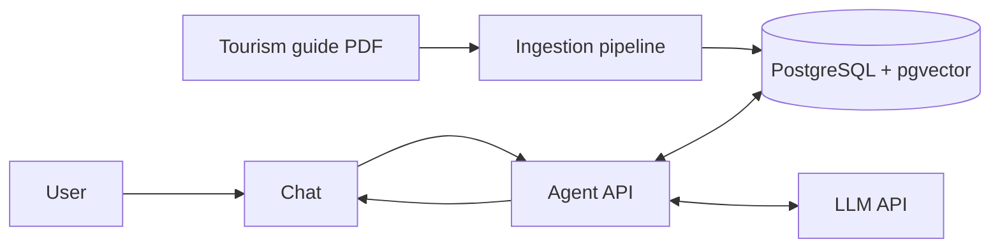

# Brittany AI Tour Guide

[](https://github.com/QuentinElGuay/portfolio-ai-tour-guide/releases)

Degemer mat ("Welcome" in Breton)!

An AI tour guide for Brittany, France. It uses **Retrieval-Augmented Generation (RAG)**
to answer travellers' questions from an indexed tourism guide.

> [!IMPORTANT]
> 🚧 This project is under **<ins>active development</ins>**.

## Table of contents

- [Overview](#overview)
- [Architecture](#architecture)
- [Question scope](#question-scope)
- [Documentation](#documentation)
- [Data source](#data-source)
- [Prerequisites](#prerequisites)
- [Quick start](#quick-start)
- [Common commands](#common-commands)
- [Evaluation](#evaluation)
- [Roadmap](#roadmap)
- [Capstone success criteria](#capstone-success-criteria)
- [Contributing](#contributing)
- [License](#license)

## Overview

Created as a capstone project for
[LLM Zoomcamp](https://github.com/DataTalksClub/llm-zoomcamp) by
[DataTalks.Club](https://datatalks.club), this project turns a Brittany tourism guide
into a question-answering experience that helps travellers explore the region. It
processes the guide into searchable passages, uses **vector embeddings** and
**PostgreSQL with pgvector** to retrieve relevant context, then asks an LLM to generate
an answer based on that context.

The project is designed as a focused portfolio demonstration of the full RAG workflow:

- Document ingestion
- Retrieval and prompt construction
- LLM integration
- A browser chat interface

The project also focuses on the practices that make RAG applications reliable:

- Keeping answers grounded in retrieved context
- Validating citations
- Evaluating retrieval and answer quality
- Adding guardrails for unsupported or overly specific questions

## Architecture

The ingestion pipeline indexes the tourism guide in PostgreSQL with pgvector. The chat
interface sends questions to the agent API, which retrieves context and calls an LLM API
to generate an answer.



## Question scope

The project supports English questions about Brittany's regions, geography and natural
landscapes, climate, transport, cost of living, real estate, family relocation and
education, outdoor recreation, history and heritage, and Breton culture, food,
festivals, and local life.

Supported examples:

- ✅ “What are the main places to visit in Brittany?”
- ✅ “What is special about Breton culture?”

Unsupported questions include:

- ❌ “What are the best places to visit in Normandy?” — another destination.
- ❌ “What is the weather in Brest today?” — current information absent from the guide.
- ❌ “Can you book a hotel in Saint-Malo for this weekend?” — booking, availability, or
  reservation requests.
- ❌ “Should I invest in renewable-energy stocks?” — an unrelated finance topic.
- ❌ “How does quantum entanglement work?” — an unrelated science topic.

> [!NOTE]
> English is the only supported language. This keeps the demonstration lightweight and
> suitable for a smaller model.

## Documentation

- [Ingestion guide](src/ai_tour_guide/ingestion/README.md): document definitions,
  pipeline stages, artifacts, and ingestion configuration.
- [Agent guide](src/ai_tour_guide/agent/README.md): RAG flow, CLI, HTTP API, and agent
  configuration.
- [Chat guide](src/ai_tour_guide/agent/chat/README.md): Gradio service and its HTTP
  integration.
- [Roadmap](ROADMAP.md): delivered work and planned validation, evaluation, and
  monitoring.

## Data source

The project indexes the freely available
*[Discovering Brittany](https://www.ibanista.com/wp-content/uploads/2025/11/Guide-Discover-Brittany-Nov-2025.pdf)*
guide published by [Ibanista](https://www.ibanista.com/). It is used for educational
purposes only and is not redistributed in this repository.

## Prerequisites

The recommended workflow requires _Git_, _Docker_ with _Docker Compose_, and _GNU Make_.

For direct Python commands, install _Python 3.14_ or newer and
_[uv](https://docs.astral.sh/uv/)_. _GitHub Codespaces_ can run the project without
local installation.

## Quick start

Clone the repository and create your environment file:

```bash
git clone https://github.com/QuentinElGuay/portfolio-ai-tour-guide.git
cd portfolio-ai-tour-guide
cp .env.template .env
```

Set an OpenAI API key in `.env` to generate answers:

```dotenv
AGENT_LLM_PROVIDER=openai
AGENT_LLM_API_KEY=your-api-key
AGENT_LLM_MODEL=gpt-4.1-mini
```

`make evaluate` and `make evaluate-judge` can optionally use a separate judge
configuration: `EVALUATION_OPENAI_JUDGE_API_KEY` and `EVALUATION_OPENAI_JUDGE_MODEL`.
When these are absent, it reuses `AGENT_LLM_API_KEY` and `AGENT_LLM_MODEL`.

> [!NOTE]
> OpenAI is the only currently supported LLM provider at the moment but more might be
> added in the future.

Initialize the database, ingest the bundled source definitions, and start the app:

```bash
make init-db
make ingest
make app
```

To initialize the Metabase dashboard, first set `METABASE_ADMIN_EMAIL` and
`METABASE_ADMIN_PASSWORD` in `.env`, then run:

```bash
make dashboard-init
```

To version the current Metabase configuration, questions, and dashboards for the Docker
setup, run:

```bash
make dashboard-export
```

This writes `fixtures/metabase/metabase.sql`. The dashboard database image bundles and
restores that backup when creating a new Metabase application database. Existing
application databases are not overwritten. Review the dump for sensitive values before
committing it.

To restore the bundled backup manually, use:

```bash
make dashboard-restore
```

This refuses to overwrite a non-empty Metabase database. To explicitly replace the
current Metabase configuration and dashboards, use:

```bash
make dashboard-restore FORCE=1
```

Only the separate `metabase` database is replaced; the application database and its
schemas are preserved.

This starts Metabase, creates the initial admin user if necessary, and registers the
project PostgreSQL database as a Metabase data source. The command is safe to rerun.
Metabase is available at `http://localhost:3000`.

Open `http://localhost:7860` to use the chat. The agent API is available at
`http://localhost:8000`; its interactive API documentation is at
`http://localhost:8000/docs`.

The first ingestion or image build can download the configured embedding model. To
recreate the application knowledge base, use `make reset-db`, then run `make ingest` to
populate the selected schema. The reset preserves the separate Metabase application
database. Use `SCHEMA` to target another schema in the same PostgreSQL database, for
example when isolating future evaluation data from local development data.

> [!WARNING]
> `make reset-db` removes all data in the selected application schema. To intentionally
> remove the entire PostgreSQL volume, including Metabase and its dashboards, run
> `docker compose --profile dashboard down --volumes --remove-orphans` explicitly.

## Common commands

Run `make help` for every available shortcut.

| Command                              | Description                                          |
| ------------------------------------ | ---------------------------------------------------- |
| `make init-db`                       | Start PostgreSQL and initialise the pgvector schema. |
| `make ingest`                        | Ingest documents defined in `source_files.json`.     |
| `make export-corpus`                 | Overwrite the current knowledge-base corpus export.  |
| `make load-corpus SCHEMA=evaluation` | Load the corpus into the evaluation schema.          |
| `make evaluate`                      | Run search, RAG, and judge evaluation.               |
| `make evaluate-search`               | Run offline search metrics only.                     |
| `make evaluate-rag`                  | Run RAG metrics without answer judging.              |
| `make evaluate-judge`                | Generate and judge RAG answers only.                 |
| `make evaluate-all`                  | Alias for `make evaluate`.                           |
| `make vector_search QUESTION='...'`  | Search chunks semantically.                          |
| `make text_search QUESTION='...'`    | Search chunks with PostgreSQL full-text search.      |
| `make ask QUESTION='...'`            | Generate an answer from retrieved context.           |
| `make ask QUESTION='...' VERBOSE=1`  | Print the complete serialized RAG trace.             |
| `make cli-chat`                      | Start the interactive terminal chat.                 |
| `make dashboard`                     | Start PostgreSQL and the Metabase dashboard.         |
| `make dashboard-init`                | Start and initialize the Metabase dashboard.         |
| `make dashboard-export`              | Export Metabase configuration and dashboards.        |
| `make app`                           | Start the agent API and Gradio chat interface.       |

See the [ingestion guide](src/ai_tour_guide/ingestion/README.md) and
[agent guide](src/ai_tour_guide/agent/README.md) for command options and local Python
workflows.

## Evaluation

The project evaluates the current corpus and RAG pipeline with a 105-case golden
dataset: 100 answerable questions and 5 unsupported questions. Each evaluation loads the
bundled corpus into an isolated `evaluation` schema.

| Evaluation | Run                    | Purpose                                                                          |
| ---------- | ---------------------- | -------------------------------------------------------------------------------- |
| Search     | `make evaluate-search` | Compare the current vector, full-text, and hybrid retrieval quality.             |
| RAG        | `make evaluate-rag`    | Measure retrieval, citation, refusal, and latency metrics without the LLM judge. |
| Judge      | `make evaluate-judge`  | Add LLM-judge answer-correctness scoring; this makes additional model calls.     |

The corresponding notebooks retain the latest executed reports and conclusions:

- [Search evaluation](evaluation/notebooks/search_evaluation.ipynb)
- [RAG evaluation](evaluation/notebooks/rag_evaluation.ipynb)
- [Judge evaluation](evaluation/notebooks/llm_judge_evaluation.ipynb)

The latest retrieval comparison used the bundled corpus, `k=5`, and the configured
`BAAI/bge-small-en-v1.5` embedding model. Hybrid search matched vector search's 98% hit
rate and recall, while improving MRR slightly (0.9275 versus 0.9175); its mean search
latency was 41 ms versus 34 ms. Full-text search was faster (8 ms) but achieved only 25%
hit rate and recall. Hybrid search is therefore the application's default retrieval
mode.

The latest hybrid RAG run over all 105 cases achieved 99.0% source precision and recall,
89.2% section precision, 96.2% section recall, and 96.2% citation validity, with no
pipeline errors. The five unsupported cases exposed a remaining refusal gap: the model
refused none of them, producing 95.2% refusal accuracy overall. The optional
`gpt-4.1-mini` judge rated 97.1% of the 105 answers correct. These are current baseline
results; prompt/model comparisons and broader robustness evaluations are deferred to
follow-up work.

## Roadmap

The complete plan, including milestones and deferred work, is maintained in
[ROADMAP.md](ROADMAP.md).

### Current release — v0.3.0: Evaluated RAG baseline

This release delivers an evaluated RAG baseline for the Brittany guide:

- Grounded answers generated from retrieved context
- Retrieved source references with deduplicated, ordered page numbers
- Hybrid retrieval selected from vector, full-text, and hybrid measurements
- Runnable search, RAG, and optional judge evaluation notebooks with saved baseline
  results
- A basic Gradio chat interface

### Next release — v0.4.0: Monitoring

The next goal is to collect feedback and make application behaviour observable. Broader
evaluation experiments, such as prompt/model comparisons and dataset versioning, remain
follow-up work rather than release blockers.

### Capstone success criteria

The project follows the
[LLM Zoomcamp capstone evaluation criteria](https://github.com/DataTalksClub/llm-zoomcamp/blob/main/project.md#evaluation-criteria).
A complete submission should demonstrate the following features:

- ✅ A clearly defined problem, target users, supported questions, and limitations.
- ✅ An accessible source dataset and reproducible instructions for running the project.
- ✅ Automated ingestion from source documents into a searchable knowledge base.
- ✅ A RAG flow that retrieves relevant context from the knowledge base before an LLM
  generates an answer.
- ✅ Retrieval evaluation that compares multiple approaches and adopts the strongest
  configuration.
- ⏳ LLM-answer evaluation that compares multiple prompt or generation approaches and
  selects the best one.
- ✅ A usable interface for asking questions, such as the chat application and HTTP API.
- ⏳ Monitoring through user feedback and a dashboard that makes application behaviour
  visible.
- 🔄 Containerised services, pinned dependency versions, and clear setup instructions for
  a reproducible local run.
- ⏳ Retrieval best practices evaluated for their value: hybrid search, reranking, and
  query rewriting.
- ⏳ Automated tests and CI/CD, followed by a cloud deployment as an optional extension.

#### Delivery status

- **✅ Passed / core complete** — the milestone's core deliverable is usable; remaining
  items are polish or follow-up
- **🔄 In progress** — work has started, but the milestone is not complete
- **⏳ Planned** — work has not started yet

## Contributing

This is a personal portfolio and learning project. External contributions are not
currently accepted, but feedback, bug reports, and suggestions are welcome through
GitHub Issues.

After `uv sync`, install the local quality hooks once:

```bash
uv run pre-commit install
```

Run all checks manually with:

```bash
uv run pre-commit run --all-files
```

## License

This repository is publicly available for educational, portfolio, and evaluation
purposes. You may browse and clone it to review the implementation, but its source code
is **not licensed for reuse**. All rights are reserved unless stated otherwise; copying,
modifying, redistributing, or incorporating this code into other projects requires prior
written permission.

The tourism guide used as the knowledge source remains the property of its copyright
holder and is not redistributed as part of this repository.
