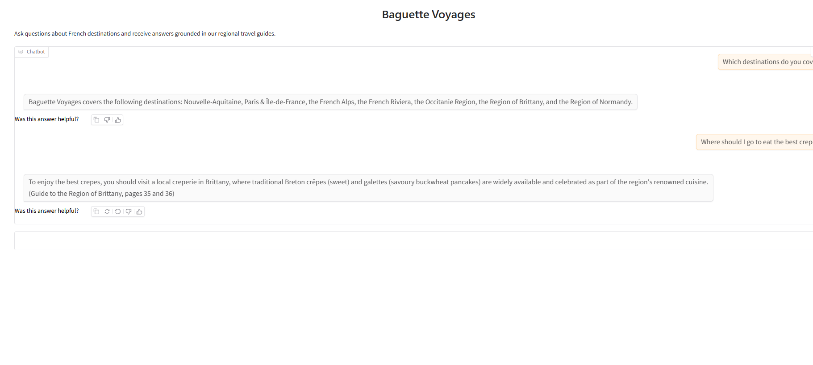
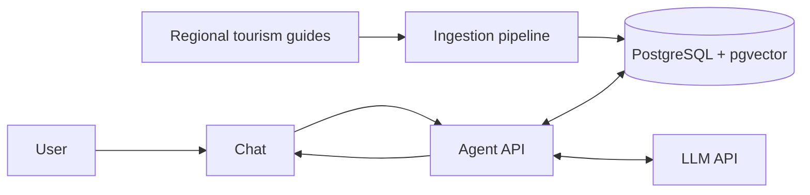

# Baguette Voyages

[](https://github.com/QuentinElGuay/portfolio-ai-tour-guide/releases)

_Salut! Je suis **Petit Guide**_, your AI travel companion from **Baguette Voyages**, a
fictional French travel company. My job is to help you prepare your visit in France by
answering your questions using **Retrieval-Augmented Generation (RAG)** based on
regional tourism guides.


## Table of contents

- [Overview](#overview)
- [Question scope](#question-scope)
- [Architecture](#architecture)
- [Tech stack](#tech-stack)
- [Prerequisites](#prerequisites)
- [Quick start](#quick-start)
- [Common commands](#common-commands)
- [Airflow ingestion](#airflow-ingestion)
- [Evaluation](#evaluation)
- [Documentation](#documentation)
- [Data source](#data-source)
- [Roadmap](#roadmap)
- [Capstone success criteria](#capstone-success-criteria)
- [Contributing](#contributing)
- [License](#license)

## Overview

Created as a capstone project for the
[LLM Zoomcamp](https://github.com/DataTalksClub/llm-zoomcamp) by
[DataTalks.Club](https://datatalks.club), this project turns French regional tourism
guides into a question-answering experience that helps travellers plan their trips.



### Project goals

The project is designed as a focused portfolio demonstration of the full RAG workflow:

- Document ingestion
- Retrieval and prompt construction
- LLM integration
- A browser chat interface

The project also focuses on the practices that make RAG applications reliable:

- Keeping answers grounded in retrieved context
- Validating citations
- Evaluating retrieval and answer quality
- Adding guardrails for unsupported or overly specific questions

## Question scope

The project supports English questions about the French destinations covered by the
indexed regional guides. Topics include geography and natural landscapes, climate,
transport, outdoor recreation, history and heritage, culture, food, festivals, and local
life.

The assistant can list the destinations it covers from the titles of the documents
currently indexed in the knowledge base. This catalog is the only information it may
answer without retrieved passages; destination-specific advice and every other detailed
question must be grounded in retrieved context.

Supported examples:

- ✅ “Which destinations do you cover?”
- ✅ “What are the main places to visit in Normandy?”
- ✅ “What should I see in Occitanie?”

Unsupported questions include:

- ❌ “What are the best places to visit in Corsica?” — a destination not covered by the
  guides.
- ❌ “What is the weather in Paris today?” — current information absent from the guides.
- ❌ “Can you book a hotel in Saint-Malo for this weekend?” — booking, availability, or
  reservation requests.
- ❌ “Should I invest in renewable-energy stocks?” — an unrelated finance topic.
- ❌ “How does quantum entanglement work?” — an unrelated science topic.

> [!NOTE]
> English is the only supported language. This keeps the demonstration lightweight and
> suitable for a smaller model.

## Architecture

The project is divided into two workflows. The ingestion workflow processes the guides
into searchable passages (_chunks_), creates vector embeddings, and stores them in
PostgreSQL with pgvector. The RAG workflow retrieves the chunks most likely to provide
relevant context, then passes them to a generic LLM provided by a commercial third-party
provider to generate an answer. The chat interface sends questions to the agent API,
which coordinates retrieval and answer generation.



## Tech stack

- **Language:** Python 3.14
- **Agent API:** FastAPI and Uvicorn
- **Chat interface:** Gradio
- **Embeddings:** FastEmbed
- **Storage and retrieval:** PostgreSQL with pgvector
- **Containerization:** Docker Compose
- **Workflow orchestration:** Apache Airflow
- **Monitoring and evaluation:** Metabase

## Prerequisites

The recommended workflow requires _Git_, _Docker_ with _Docker Compose_, and _GNU Make_.

For direct Python commands, install _Python 3.14_ or newer and
_[uv](https://docs.astral.sh/uv/)_. _GitHub Codespaces_ can run the project without
local installation.

## Quick start

With Docker, Docker Compose, and GNU Make installed, run:

```bash
git clone https://github.com/QuentinElGuay/portfolio-ai-tour-guide.git
cd portfolio-ai-tour-guide
cp .env.template .env
make db-init
make ingest
make app
```

The template starts the no-cost, limited Brittany demo. Its minimum LLM configuration
is:

```dotenv
AGENT_LLM_PROVIDER=baguette-llm
AGENT_LLM_MODEL=mini-croissant-1.0
```

The demo recognizes [prepared Brittany questions](fixtures/demo_dataset.jsonl) and
modest spelling or punctuation variations. It suggests a supported question when it
cannot answer.

The demo does not use an API key. To use a live LLM, replace those settings and add your
OpenAI API key:

```dotenv
AGENT_LLM_PROVIDER=openai
AGENT_LLM_API_KEY=your-api-key
AGENT_LLM_MODEL=gpt-4.1-mini
```

> [!NOTE]
> `OpenAI` is currently the only supported provider for live answer generation, and
> `gpt-4.1-mini` is the recommended model.

Open [http://localhost:7860](http://localhost:7860) to use the chat. The API is
available at [http://localhost:8000](http://localhost:8000), with interactive
documentation at [http://localhost:8000/docs](http://localhost:8000/docs).

For detailed setup, demo limitations, Airflow ingestion, evaluation, and dashboard
monitoring, follow the [tutorial](docs/README.md).

## Common commands

These are the commands used most often during local development:

| Command             | Description                                         |
| ------------------- | --------------------------------------------------- |
| `make db-init`      | Initialize the pgvector application schema.         |
| `make ingest`       | Ingest the documents in `source_files.json`.        |
| `make app`          | Start the agent API and Gradio chat interface.      |
| `make airflow`      | Start Airflow for parameterized ingestion.          |
| `make evaluate`     | Run the full evaluation suite.                      |
| `make dashboard`    | Start and initialize PostgreSQL and Metabase.       |
| `make simulate-rag` | Add synthetic traffic to the monitoring dashboards. |
| `make stop`         | Stop the running Compose services.                  |

For every command, its options, and operational cautions, see the
[Make command reference](docs/commands.md). `make help` remains the short terminal
reference. The [tutorial](docs/README.md),
[ingestion guide](src/ai_tour_guide/ingestion/README.md), and
[agent guide](src/ai_tour_guide/agent/README.md) cover the related workflows in detail.

## Airflow ingestion

Start the optional Airflow profile:

```bash
make airflow
```

`make airflow` returns only after Airflow is ready: its API health check confirms the
metadata database, scheduler, and DAG processor are healthy. Open the Airflow UI at
[http://localhost:8080](http://localhost:8080), then sign in with
`AIRFLOW_ADMIN_USERNAME` and `AIRFLOW_ADMIN_PASSWORD` from `.env`, then trigger the
`ingest_documents` DAG with a configuration shaped as follows:

```json
{
  "source_files": [
    {
      "source_url": "https://example.com/guide.pdf",
      "title": "Example guide",
      "collection": "Regional Guides",
      "publisher": "Example publisher"
    }
  ]
}
```

`source_files` is the same array format accepted by `source_files.json`. The DAG runs
`initialize_database` before one mapped `run_ingestion` task per source file. Each task
runs the complete ingestion CLI in the `ai-tour-guide-ingestion:local` image, so a
failed document can be retried without rerunning the other submitted documents.

Existing documents are skipped successfully by default. Set `force_reingestion` to
`true` in the trigger configuration to remove the existing document and its chunks
before inserting the replacement. For example:

```json
{
  "source_files": [
    {
      "source_url": "https://example.com/guide.pdf",
      "title": "Example guide"
    }
  ],
  "force_reingestion": true
}
```

The template supplies local-development Airflow credentials and encryption keys so this
optional profile does not break existing `.env` files. Change the `AIRFLOW_*` secrets
before sharing an Airflow instance.

The Airflow scheduler mounts the host Docker socket and uses the host daemon to create
the ingestion container on the `ai-tour-guide-network` network. This is intentionally
not Docker-in-Docker: it avoids a nested daemon and lets the task resolve the Compose
database as `database`. Access to the Docker socket is highly privileged; enable this
profile only on trusted development hosts.

Task logs are stored in the persistent `airflow_logs` volume, shared by the scheduler
and API server. This keeps completed task logs available after either service restarts.

## Evaluation

The project evaluates the current corpus and RAG pipeline with a 105-case golden
dataset: 100 answerable questions and 5 unsupported questions. Each evaluation loads the
bundled corpus into an isolated `evaluation` schema.

| Evaluation | Run                    | Purpose                                                                          |
| ---------- | ---------------------- | -------------------------------------------------------------------------------- |
| Search     | `make evaluate-search` | Compare the current vector, full-text, and hybrid retrieval quality.             |
| RAG        | `make evaluate-rag`    | Measure retrieval, citation, refusal, and latency metrics without the LLM judge. |
| Judge      | `make evaluate-judge`  | Add LLM-judge answer-correctness scoring; this makes additional model calls.     |

The corresponding notebooks retain the latest executed reports and conclusions:

- [Search evaluation](evaluation/notebooks/search_evaluation.ipynb)
- [RAG evaluation](evaluation/notebooks/rag_evaluation.ipynb)
- [Judge evaluation](evaluation/notebooks/llm_judge_evaluation.ipynb)

The latest retrieval comparison used the bundled corpus, `k=5`, and the configured
`BAAI/bge-small-en-v1.5` embedding model. Hybrid search matched vector search's 98% hit
rate and recall, while improving MRR slightly (0.9275 versus 0.9175); its mean search
latency was 41 ms versus 34 ms. Full-text search was faster (8 ms) but achieved only 25%
hit rate and recall. Hybrid search is therefore the application's default retrieval
mode.

The latest hybrid RAG run over all 105 cases achieved 99.0% source precision and recall,
89.2% section precision, 96.2% section recall, and 96.2% citation validity, with no
pipeline errors. The five unsupported cases exposed a remaining refusal gap: the model
refused none of them, producing 95.2% refusal accuracy overall. The optional
`gpt-4.1-mini` judge rated 97.1% of the 105 answers correct. These are current baseline
results; prompt/model comparisons and broader robustness evaluations are deferred to
follow-up work.

## Documentation

- [Ingestion guide](src/ai_tour_guide/ingestion/README.md): document definitions,
  pipeline stages, artifacts, and ingestion configuration.
- [Agent guide](src/ai_tour_guide/agent/README.md): RAG flow, CLI, HTTP API, and agent
  configuration.
- [Chat guide](src/ai_tour_guide/agent/chat/README.md): Gradio service and its HTTP
  integration.
- [Make command reference](docs/commands.md): every project command, its options, and
  its operational cautions.
- [Tutorial](docs/README.md): end-to-end walkthrough for ingestion, chat, evaluation,
  and monitoring.
- [Roadmap](ROADMAP.md): delivered work and planned validation, evaluation, and
  monitoring.

## Data source

The project indexes the freely available French regional guides listed in
[`source_files.json`](source_files.json), published by
[Ibanista](https://www.ibanista.com/). They are used for educational purposes only and
are not redistributed in this repository.

## Roadmap

The complete plan, including milestones and deferred work, is maintained in
[ROADMAP.md](ROADMAP.md).

### Current release — v1.0.0: Final submission

This release delivers the complete Baguette Voyages portfolio application:

- Multi-region document ingestion from regional tourism guides
- Grounded answers with validated source references and indexed destination discovery
- Hybrid retrieval selected from vector, full-text, and hybrid measurements
- Airflow 3 orchestration with mapped ingestion, safe skipping, and forced re-ingestion
- Gradio chat interface, HTTP API, and Metabase monitoring dashboards
- Reproducible Docker Compose setup with health checks and CI/CD validation
- End-to-end tutorial, public screenshots, evaluation reports, and smoke tests

### Follow-up work

Further hardening and experiments remain tracked in the [roadmap](ROADMAP.md), including
runtime container tests, Airflow integration coverage, prompt comparisons, and optional
cloud deployment.

### Capstone success criteria

The project follows the
[LLM Zoomcamp capstone evaluation criteria](https://github.com/DataTalksClub/llm-zoomcamp/blob/main/project.md#evaluation-criteria).

A complete submission should demonstrate the following features:

- ✅ A clearly defined problem, target users, supported questions, and limitations.
- ✅ An accessible source dataset and reproducible instructions for running the project.
- ✅ Automated ingestion from source documents into a searchable knowledge base.
- ✅ A RAG flow that retrieves relevant context from the knowledge base before an LLM
  generates an answer.
- ✅ Retrieval evaluation that compares multiple approaches and adopts the strongest
  configuration.
- ⏳ LLM-answer evaluation that compares multiple prompt or generation approaches and
  selects the best one.
- ✅ A usable interface for asking questions, such as the chat application and HTTP API.
- ✅ Monitoring through user feedback and dashboards that make application behaviour
  visible.
- ✅ Containerised services, pinned dependency versions, and clear setup instructions for
  a reproducible local run.
- ✅ Hybrid search evaluated against vector and full-text retrieval and selected as the
  application default.
- ⏳ Reranking and query rewriting remain optional follow-up experiments.
- ✅ Automated tests and CI/CD; cloud deployment remains an optional extension.

#### Delivery status

- **✅ Passed / core complete** — the milestone's core deliverable is usable; remaining
  items are polish or follow-up
- **🔄 In progress** — work has started, but the milestone is not complete
- **⏳ Planned** — work has not started yet

## Contributing

This is a personal portfolio and learning project. External contributions are not
currently accepted, but feedback, bug reports, and suggestions are welcome through
GitHub Issues.

After `uv sync`, install the local quality hooks once:

```bash
uv run pre-commit install
```

Run all checks manually with:

```bash
uv run pre-commit run --all-files
```

## License

This repository is publicly available for educational, portfolio, and evaluation
purposes. You may browse and clone it to review the implementation, but its source code
is **not licensed for reuse**. All rights are reserved unless stated otherwise; copying,
modifying, redistributing, or incorporating this code into other projects requires prior
written permission.

The tourism guide used as the knowledge source remains the property of its copyright
holder and is not redistributed as part of this repository.
