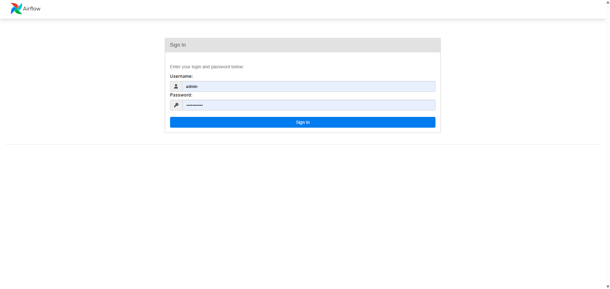
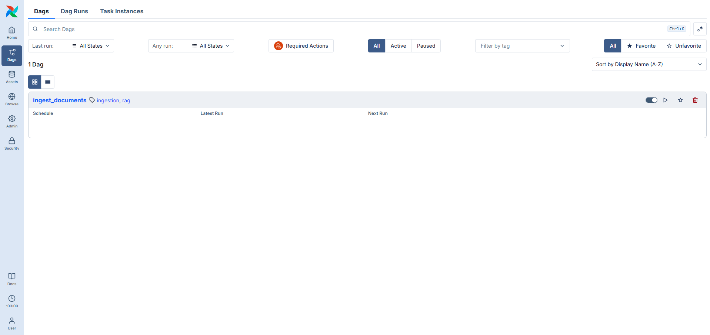
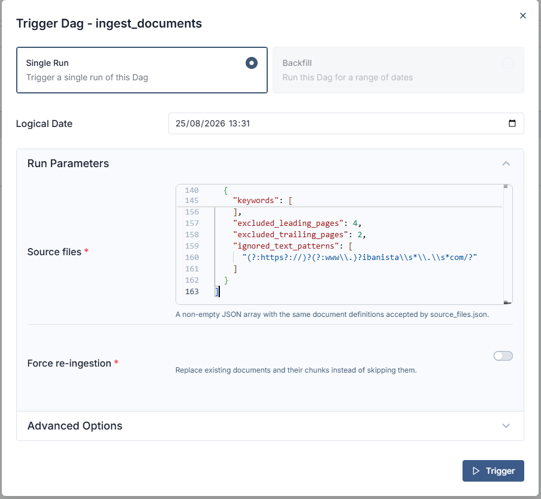
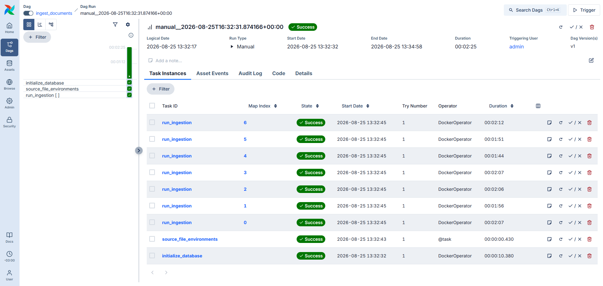

# "Baguette Voyages" chat app tutorial

This tutorial starts the local Airflow environment and ingests the document definitions
from `source_files.json` into the Baguette Voyages knowledge base. See the
[project README](../../README.md) for prerequisites and environment configuration.

## Ingestion with Airflow

Start the Airflow environment:

```bash
make airflow
```

The command starts Airflow, the ingestion image, and the required databases. It returns
only after the Airflow API, metadata database, scheduler, and DAG processor are ready.
It does not ingest documents by itself.

Open the Airflow interface at [http://localhost:8080](http://localhost:8080) and sign in
with `AIRFLOW_ADMIN_USERNAME` and `AIRFLOW_ADMIN_PASSWORD` from `.env`. The values below
are development defaults from `.env.template`; change them before sharing an Airflow
instance:

```
Username: admin
Password: pa$$word123
```



Open the **DAGs** tab and click **Trigger** for the `ingest_documents` DAG.



Copy the JSON array from `source_files.json` into the **Source files** field, then click
**Trigger**. The DAG first initializes the application database, then runs one ingestion
task per source file.

By default, an already ingested document is skipped successfully. Select **Force
re-ingestion** only when you intend to replace a document: it deletes the existing
document and its related chunks before inserting the replacement.



Wait for the DAG run to finish. Ingestion duration depends on the number and size of the
documents, and the first run may need to download the embedding model.



## Ingestion with the command line

Use the command line when you do not need Airflow's task orchestration or web interface.
The Docker Compose shortcut initializes the application schema, then ingests every
document definition in `source_files.json`:

```bash
make init-db
make ingest
```

To use another JSON definition file or retain intermediate parsing artifacts, run:

```bash
make ingest SOURCE_FILES=data/another-source.json
make ingest DEBUG=1
```

Like Airflow, `make ingest` skips a document when the same `(source_url, version)` is
already present. To intentionally replace a document and its related chunks, run:

```bash
make ingest FORCE=1
```

For a local Python workflow, install the project with `uv sync`, start and initialize
the database with `make init-db`, then run the ingestion CLI directly:

```bash
uv run portfolio-ai-tour-guide-ingestion run source_files.json
```

The direct CLI also supports `--skip-existing` and `--force`; these options are mutually
exclusive. See the [ingestion guide](../../src/ai_tour_guide/ingestion/README.md) for
the full command reference and document-definition format.
