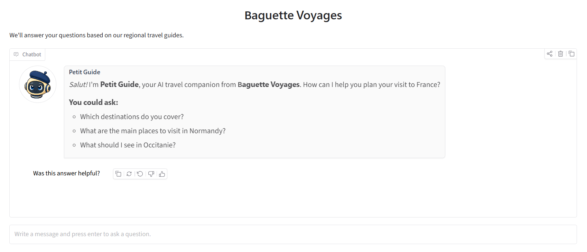
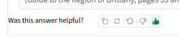

# "Baguette Voyages" tutorial

This tutorial guides you through document ingestion, the Baguette Voyages chat app,
evaluation, and monitoring. See the [project README](../README.md) for prerequisites and
environment configuration, and the [Make command reference](commands.md) for every
available project command.

## Table of contents

- [Before you begin](#before-you-begin)
- [Ingestion with Airflow](#ingestion-with-airflow)
- [Ingestion with the command line](#ingestion-with-the-command-line)
- [Chat app](#chat-app)
- [Evaluation](#evaluation)
- [Monitoring](#monitoring)
  - [Traffic simulation](#traffic-simulation)

## Before you begin

Create a local environment file from the template:

```bash
cp .env.template .env
```

The template defaults to the no-cost Brittany demo and does not require an API key:

```dotenv
AGENT_LLM_PROVIDER=baguette-llm
AGENT_LLM_API_KEY=
AGENT_LLM_MODEL=mini-croissant-1.0
```

The demo can answer a prepared set of Brittany questions. For any other question, it
explains that it is a limited demo and suggests a question it can answer.

For live answer generation, switch to OpenAI and set your API key:

```dotenv
AGENT_LLM_PROVIDER=openai
AGENT_LLM_API_KEY=your-api-key
AGENT_LLM_MODEL=gpt-4.1-mini
```

OpenAI is the only supported provider for live answer generation, and `gpt-4.1-mini` is
the recommended model for this project.

The tutorial also uses the Airflow and Metabase credentials from `.env`. The template
contains development defaults for these values; replace them before sharing the services
or using them in production.

## Ingestion with Airflow

Start the Airflow environment:

```bash
make airflow
```

The command starts Airflow, the ingestion image, and the required databases. It returns
only after the Airflow API, metadata database, scheduler, and DAG processor are ready.
It does not ingest documents by itself.

Open the Airflow interface at [http://localhost:8080](http://localhost:8080) and sign in
with `AIRFLOW_ADMIN_USERNAME` and `AIRFLOW_ADMIN_PASSWORD` from `.env`. By default, the
values from `.env.template` are:

```
Username: admin
Password: pa$$word123
```

> [!IMPORTANT]
> Do not use those values in production.


Open the **DAGs** tab and click **Trigger** next to the `ingest_documents` DAG.


Copy the JSON array from `source_files.json` into the **Source files** field and click
**Trigger**. The DAG first initializes the application database, then runs one ingestion
task for each source file.

By default, an already ingested document is skipped successfully. Select **Force
re-ingestion** only when you intend to replace a document: it deletes the existing
document and its related chunks before inserting the replacement.


Wait for the DAG run to finish. The ingestion time depends on the number and size of the
documents. The first run may also need to download the embedding model.


## Ingestion with the command line

Use the command line when you do not need Airflow's orchestration or web interface. The
Docker Compose shortcuts initialize the application schema and then ingest every
document definition in `source_files.json`:

```bash
make db-init
make ingest
```

To use another JSON definition file or retain intermediate parsing artifacts, run:

```bash
make ingest SOURCE_FILES=data/another-source.json
make ingest DEBUG=1
```

Like Airflow, `make ingest` skips a document when the same `(source_url, version)` is
already present. To intentionally replace a document and its related chunks, run:

```bash
make ingest FORCE=1
```

For a local Python workflow, install the project with `uv sync`, start and initialize
the database with `make db-init`, then run the ingestion CLI directly:

```bash
uv run portfolio-ai-tour-guide-ingestion run source_files.json
```

The direct CLI also supports `--skip-existing` and `--force`; these options are mutually
exclusive. See the [ingestion guide](../src/ai_tour_guide/ingestion/README.md) for the
full command reference and document-definition format.

## Chat app

Once at least one document has been ingested, start the Baguette Voyages chat app:

```bash
make app
```

The command starts the agent API and the Gradio chat interface. Open
[http://localhost:7860](http://localhost:7860) in your browser.



The chat can list the destinations covered by the indexed guides. For detailed
questions, ask about a destination covered by one of the guides—for example:

```text
Which destinations do you cover?
Where should I go to try the best French crepes?
What should I see in Occitanie?
```

The first question uses the indexed destination catalog. The detailed questions use
retrieved passages and display the source titles and page numbers below each answer.


Use the Like and Dislike controls to record feedback about an answer.



## Evaluation

The evaluation workflow measures retrieval and answer quality against the repository's
golden dataset. It loads the evaluation corpus into a separate `evaluation` schema, so
it does not replace the public application corpus.

Run the retrieval evaluation first:

```bash
make evaluate-search
```

To evaluate the RAG pipeline without making additional judge-model calls, run:

```bash
make evaluate-rag
```

To generate answer-correctness scores with the configured LLM judge, run:

```bash
make evaluate-judge
```

The judge requires an OpenAI API key. Set `EVALUATION_OPENAI_JUDGE_API_KEY` and
`EVALUATION_OPENAI_JUDGE_MODEL` in `.env`. If they are not set, the workflow reuses the
agent's `AGENT_LLM_API_KEY` and `AGENT_LLM_MODEL`. To run the complete evaluation suite,
use `make evaluate`.

Evaluation is intended for comparing the current pipeline and configuration, not for
populating the production knowledge base. The latest reports and baseline results are
described in the [project README](../README.md#evaluation).

## Monitoring

The project includes a Metabase dashboard for exploring persisted RAG requests, answer
feedback, quality metrics, and model usage costs.

Start and initialize PostgreSQL and Metabase:

```bash
make dashboard
```

On the first run, the `metabase-database` service creates the Metabase application
database and restores the bundled `fixtures/metabase/metabase.sql` fixture if the
database is new or empty. Existing non-empty Metabase databases are preserved.

The `dashboard` target automatically initializes the Metabase instance after starting
it. This creates the initial Metabase administrator and registers the project PostgreSQL
databases as data sources.

Open [http://localhost:3000](http://localhost:3000) and sign in with
`METABASE_ADMIN_EMAIL` and `METABASE_ADMIN_PASSWORD` from `.env`. By default, the values
from `.env.template` are:

```
Email address: admin@example.com
Password: pa$$word123
```

> [!IMPORTANT]
> Do not use those values in production.

The default `Operational Overview` dashboard displays request volume, error rate, and
user feedback. The `Cost` tab provides charts for token usage and costs.


Under `Our analytics`, you can find the `Evaluation dashboard`, which provides an
overview of the `Search`, `RAG`, and `LLM Judge` evaluations.


### Traffic simulation

To populate the dashboards with example operational traffic, run:

```bash
make simulate-rag
```

The simulated traffic is marked as synthetic and is useful for exploring the dashboard
without real chat requests and feedback.
