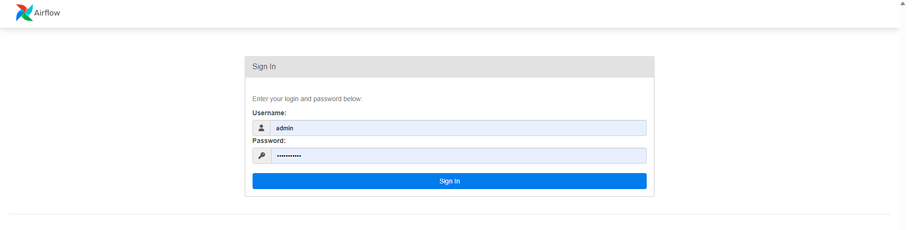
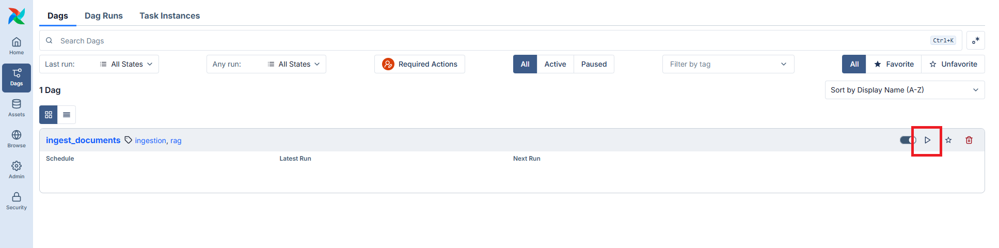
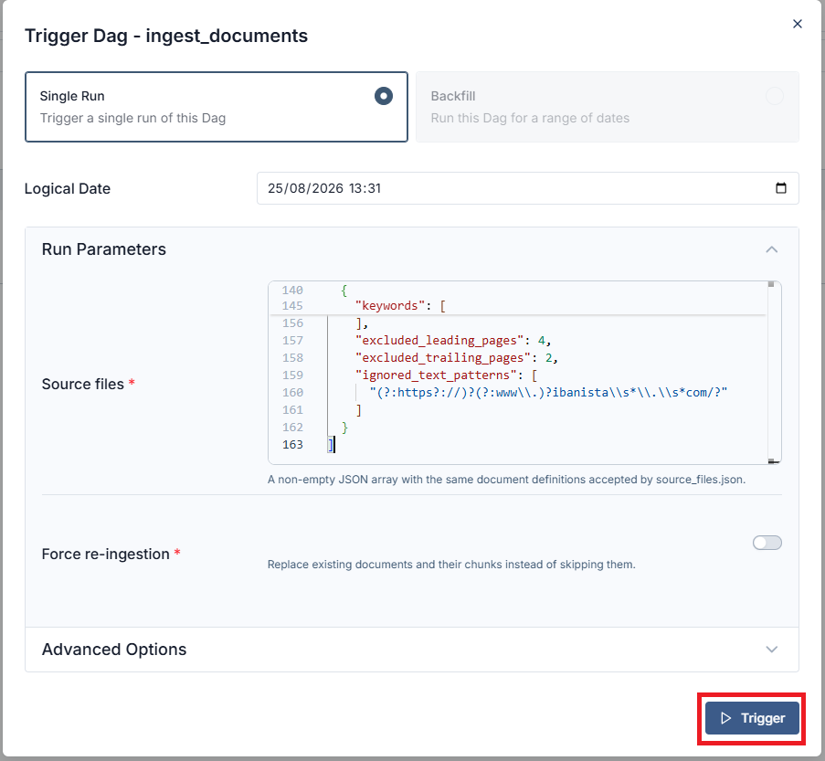
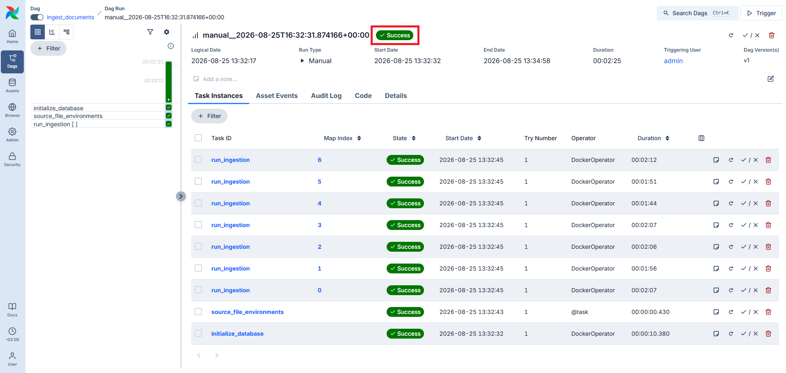
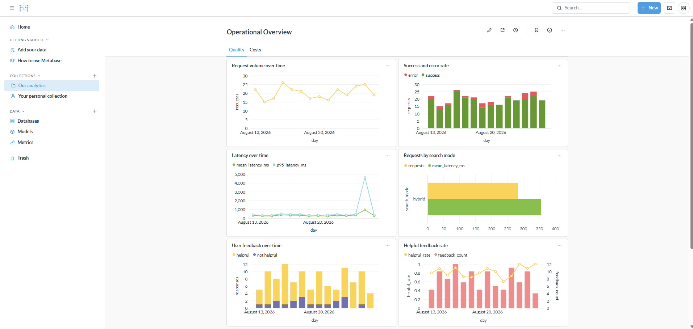
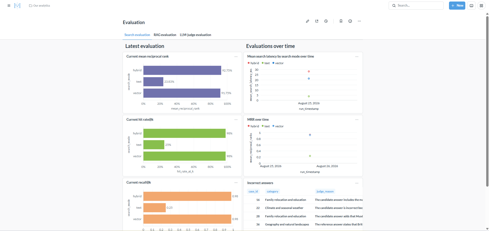

# _Bon Voyage_ tutorial

This tutorial guides you through document ingestion, the Bon Voyage chat app,
evaluation, and monitoring. See the [project README](../README.md) for prerequisites and
environment configuration, and the [Make command reference](commands.md) for every
available project command.

## Table of contents

- [1. Prerequisites](#1-prerequisites)
- [2. Progressive setup](#2-progressive-setup)
  - [2.1 Start from a clean knowledge base](#21-start-from-a-clean-knowledge-base)
  - [2.2 Deterministic demo](#22-deterministic-demo)
  - [2.3 Search-engine mode](#23-search-engine-mode)
    - [2.3.1 Ingest guides with Airflow](#231-ingest-guides-with-airflow)
  - [2.4 LLM agent mode](#24-llm-agent-mode)
- [3. Ingestion with the command line](#3-ingestion-with-the-command-line)
- [4. Chat app](#4-chat-app)
- [6. Evaluation](#6-evaluation)
- [7. Monitoring](#7-monitoring)
  - [7.1 Traffic simulation](#71-traffic-simulation)

## 1. Prerequisites

For the Docker-based tutorial, install:

- [Git](https://git-scm.com/downloads)
- [Docker](https://docs.docker.com/get-docker/) with Docker Compose
- [GNU Make](https://www.gnu.org/software/make/)

To run Python commands directly on your host, also install Python 3.14 or newer and
[uv](https://docs.astral.sh/uv/).

> [!NOTE]
> GitHub Codespaces already provides the development environment, so no local
> installation is required there.

> [!WARNING]
> As of September 8, 2026, we observed a possible Docker networking problem in GitHub
> Codespaces that prevented database initialization or document ingestion. The same
> commands worked locally, but recreating a Codespace did not reliably resolve the
> issue.

Verify the required tools before continuing:

```bash
git --version
docker --version
docker compose version
make --version
```

## 2. Progressive setup

Create a local environment file from the template:

```bash
cp .env.template .env
```

The template enables both the LLM and retrieval by default.

```dotenv
APP_ENABLE_LLM=1
APP_ENABLE_RETRIEVAL=1
```

The steps below deliberately switch between configurations so you can see how each layer
changes the experience.

### 2.1 Start from a clean knowledge base

If you already followed the quick start, stop the running services and reset the default
application schema before starting the tutorial from the beginning:

```bash
make stop
make db-reset
```

> [!WARNING]
> `make db-reset` permanently deletes the application documents, chunks, and indexes in
> the selected schema. It resets the default `public` schema but preserves the separate
> Metabase database. Do not run it if you need to keep your current knowledge base.

### 2.2 Deterministic demo

This mode starts the limited no-cost demo chat that works without an API key or ingested
documents. It answers a prepared set of questions deterministically. Set both capability
flags to `0` in `.env`:

```dotenv
APP_ENABLE_LLM=0
APP_ENABLE_RETRIEVAL=0
```

Start the application:

```bash
make app
```

Try a question such as:

```text
What should I visit in Brittany?
```

The response comes from the prepared demo dataset, without document retrieval or an LLM.

### 2.3 Search-engine mode

This mode enables retrieval from a `knowledge base` while keeping the LLM disabled.
Before changing modes, stop the running app with `make stop`.

```bash
make stop
```

Set `APP_ENABLE_RETRIEVAL` to `1` while keeping `APP_ENABLE_LLM` to `0` in the `.env`
file:

```dotenv
APP_ENABLE_LLM=0
APP_ENABLE_RETRIEVAL=1
```

#### 2.3.1 Ingest guides with Airflow

> [!WARNING]
> Airflow 3 requires a 4-core machine type in GitHub Codespaces. On smaller machines,
> use the [command-line workflow](#ingestion-with-the-command-line) instead.

Airflow is the recommended ingestion workflow because it makes the source-file inputs,
per-document tasks, retries, and re-ingestion controls visible and reproducible. Start
the Airflow environment:

```bash
make airflow
```

The command starts Airflow, the ingestion image, and the required databases. It returns
only after the Airflow API, metadata database, scheduler, and DAG processor are ready.
It does not ingest documents by itself.

Open the Airflow interface at [http://localhost:8080](http://localhost:8080) and sign in
with `AIRFLOW_ADMIN_USERNAME` and `AIRFLOW_ADMIN_PASSWORD` from `.env`. By default, the
values from `.env.template` are:

```
Username: admin
Password: pa$$word123
```

> [!IMPORTANT]
> Do not use those values in production.



Open the **DAGs** tab and click **Trigger** next to the `ingest_documents` DAG.



Copy the JSON array from `source_files.json` into the **Source files** field and click
**Trigger**. The DAG first initializes the application database, then runs one ingestion
task for each source file.

By default, an already ingested document is skipped successfully. Select **Force
re-ingestion** only when you intend to replace a document: it deletes the existing
document and its related chunks before inserting the replacement.



Wait for the DAG run to finish. The ingestion time depends on the number and size of the
documents. The first run may also need to download the embedding model.



The guides are now indexed in the same knowledge base used by the application. Start the
search-engine mode:

```bash
make app
```

The application now behaves like a search engine: it retrieves relevant passages and
formats them directly, without generating an answer with an LLM. This is similar in
spirit to an [Alexa skill](https://developer.amazon.com/en-US/alexa): the assistant
recognizes a supported request, invokes a focused capability, and formats the result
instead of generating an unconstrained answer. For example, it could handle a request to
play a specific song or artist. Here, the focused capability is retrieving travel
information from the knowledge base. Try a question such as:

```text
What should I see in Occitanie?
```

### 2.4 LLM agent mode

Configure a supported provider and API key in `.env`, then enable both capabilities:

```dotenv
AGENT_LLM_PROVIDER=openai
AGENT_LLM_API_KEY=your-api-key
AGENT_LLM_MODEL=gpt-4.1-mini
APP_ENABLE_LLM=1
APP_ENABLE_RETRIEVAL=1
```

Stop and restart the app with `make stop` followed by `make app` so the new provider and
capability settings are loaded. The agent uses retrieved passages to ground its LLM
answers and returns validated source pages. Try a question such as:

```text
What are the main places to visit in Normandy?
```

Once it is running, you can access:

- the chat app at [http://localhost:7860](http://localhost:7860);
- the chat API at [http://localhost:8000](http://localhost:8000);
- the interactive API documentation at
  [http://localhost:8000/docs](http://localhost:8000/docs).

Supported live LLM providers and recommended models:

- ChatGPT (OpenAI): `gpt-4.1-mini`
- Gemini (Google): `gemini-3.5-flash-lite`

The tutorial also uses the Airflow and Metabase credentials from `.env`. The template
contains development defaults for these values; replace them before sharing the services
or using them in production.

## 3. Ingestion with the command line

`make ingest` is the fast setup shortcut when you do not need Airflow's orchestration or
web interface. Run these commands to initialize the application schema and then ingest
every document definition in `source_files.json`:

```bash
make db-init
make ingest
```

To use another JSON definition file or retain intermediate parsing artifacts, run:

```bash
make ingest SOURCE_FILES=data/another-source.json
make ingest DEBUG=1
```

Like Airflow, `make ingest` skips a document when the same `(source_url, version)` is
already present. To intentionally replace a document and its related chunks, run:

```bash
make ingest FORCE=1
```

For a local Python workflow, install the project with `uv sync`, start and initialize
the database with `make db-init`, then run the ingestion CLI directly:

```bash
uv run portfolio-ai-tour-guide-ingestion run source_files.json
```

The direct CLI also supports `--skip-existing` and `--force`; these options are mutually
exclusive. See the [ingestion guide](../src/ai_tour_guide/ingestion/README.md) for the
full command reference and document-definition format.

## 4. Chat app

After ingestion, start the Bon Voyage chat app:

```bash
make app
```

The command starts the app API and the Gradio chat interface. Open
[http://localhost:7860](http://localhost:7860) in your browser.


Each chat session starts with a welcome from **Petit Guide**, followed by a second
message containing example questions. Assistant messages are labelled **Petit Guide**
and user messages are labelled **You**. The chat uses transparent message bubbles so the
labels and avatars remain the primary visual distinction.

The chat can list the destinations covered by the indexed guides. For detailed
questions, ask about a destination covered by one of the guides—for example:

```text
Which destinations do you cover?
Where should I go to try the best French crepes?
What should I see in Occitanie?
```

The first question uses the indexed destination catalog. The detailed questions use
retrieved passages and display the source titles and page numbers below each answer.


Use the Like and Dislike controls to record feedback about an answer.


## 6. Evaluation

The evaluation workflow measures retrieval and answer quality against the repository's
golden dataset. It loads the evaluation corpus into a separate `evaluation` schema, so
it does not replace the public application corpus.

Run the retrieval evaluation first:

```bash
make evaluate-search
```

To evaluate the RAG pipeline without making additional judge-model calls, run:

```bash
make evaluate-rag
```

To generate answer-correctness scores with the configured LLM judge, run:

```bash
make evaluate-judge
```

The judge requires an OpenAI API key. Set `EVALUATION_OPENAI_JUDGE_API_KEY` and
`EVALUATION_OPENAI_JUDGE_MODEL` in `.env`. If they are not set, the workflow reuses the
agent's `AGENT_LLM_API_KEY` and `AGENT_LLM_MODEL`. To run the complete evaluation suite,
use `make evaluate`.

Evaluation is intended for comparing the current pipeline and configuration, not for
populating the production knowledge base. The latest reports and baseline results are
described in the [project README](../README.md#evaluation).

## 7. Monitoring

The project includes a Metabase dashboard for exploring persisted RAG requests, answer
feedback, quality metrics, and model usage costs.

Start and initialize PostgreSQL and Metabase:

```bash
make dashboard
```

On the first run, the `metabase-database` service creates the Metabase application
database and restores the bundled `fixtures/metabase/metabase.sql` fixture if the
database is new or empty. Existing non-empty Metabase databases are preserved.

The `dashboard` target automatically initializes the Metabase instance after starting
it. This creates the initial Metabase administrator and registers the project PostgreSQL
databases as data sources.

Open [http://localhost:3000](http://localhost:3000) and sign in with
`METABASE_ADMIN_EMAIL` and `METABASE_ADMIN_PASSWORD` from `.env`. By default, the values
from `.env.template` are:

```
Email address: admin@example.com
Password: pa$$word123
```

> [!IMPORTANT]
> Do not use those values in production.

The default `Operational Overview` dashboard displays request volume, error rate, and
user feedback. The `Cost` tab provides charts for token usage and costs.



Under `Our analytics`, you can find the `Evaluation dashboard`, which provides an
overview of the `Search`, `RAG`, and `LLM Judge` evaluations.



### 7.1 Traffic simulation

To populate the dashboards with example operational traffic, run:

```bash
make simulate-rag
```

The simulated traffic is marked as synthetic and is useful for exploring the dashboard
without real chat requests and feedback.
