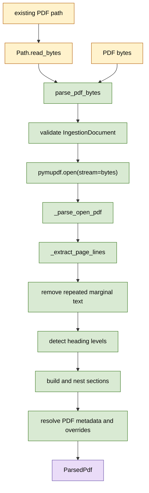

# PDF ingestion and parsing flow

The ingestion package is organized as five independent, one-document stages. Each stage
has a typed Python interface and a thin CLI adapter. The `run` command is the only
interface that accepts multiple documents.

## Pipeline overview

```mermaid
flowchart LR
    SPEC["IngestionDocument"]
    DOWNLOAD["download_pdf_stage"]
    DOWNLOADED["DownloadedPdf"]
    PARSE["parse_pdf_stage"]
    PARSED["ParsedDocumentArtifact"]
    CHUNK["chunk_document_stage"]
    CHUNKED["ChunkedDocumentArtifact"]
    EMBED["embed_document_stage"]
    EMBEDDED["EmbeddedDocumentArtifact"]
    LOAD["load_document_stage"]
    DB[("PostgreSQL")]

    SPEC --> DOWNLOAD --> DOWNLOADED
    DOWNLOADED --> PARSE --> PARSED
    PARSED --> CHUNK --> CHUNKED
    CHUNKED --> EMBED --> EMBEDDED
    EMBEDDED --> LOAD --> DB

    DOWNLOADED -. "download CLI" .-> PDF_FILE[".pdf"]
    PARSED -. "JSON serializer" .-> PARSED_FILE[".parsed.json"]
    CHUNKED -. "JSON serializer" .-> CHUNKED_FILE[".chunked.json"]
    EMBEDDED -. "JSON serializer" .-> EMBEDDED_FILE[".embedded.json"]

    classDef input fill:#fff2cc,stroke:#b45f06,color:#000;
    classDef stage fill:#d9ead3,stroke:#38761d,color:#000;
    classDef value fill:#eadcf8,stroke:#674ea7,color:#000;
    classDef file fill:#d9eaf7,stroke:#0b5394,color:#000;
    class SPEC input;
    class DOWNLOAD,PARSE,CHUNK,EMBED,LOAD stage;
    class DOWNLOADED,PARSED,CHUNKED,EMBEDDED value;
    class PDF_FILE,PARSED_FILE,CHUNKED_FILE,EMBEDDED_FILE file;
```



The solid path is the in-memory pipeline. The dotted branches are file boundaries used
by independent CLI or workflow tasks.

| Stage    | Python input               | Python output              | CLI command |
| -------- | -------------------------- | -------------------------- | ----------- |
| Download | `IngestionDocument`        | `DownloadedPdf`            | `download`  |
| Parse    | `DownloadedPdf`            | `ParsedDocumentArtifact`   | `parse`     |
| Chunk    | `ParsedDocumentArtifact`   | `ChunkedDocumentArtifact`  | `chunk`     |
| Embed    | `ChunkedDocumentArtifact`  | `EmbeddedDocumentArtifact` | `embed`     |
| Load     | `EmbeddedDocumentArtifact` | database document ID       | `load`      |

The JSON envelopes contain an `artifact_type` and `schema_version`. Parsed JSON also
retains the original ingestion definition. Chunked and embedded JSON are self-contained
and carry the document metadata alongside their chunks.

## Independent file-based execution

The subcommands can be mapped directly to Airflow tasks:

```bash
portfolio-ai-tour-guide-ingestion download document.json -o guide.pdf
portfolio-ai-tour-guide-ingestion parse document.json guide.pdf \
    -o guide.parsed.json
portfolio-ai-tour-guide-ingestion chunk guide.parsed.json \
    -o guide.chunked.json
portfolio-ai-tour-guide-ingestion embed guide.chunked.json \
    -o guide.embedded.json
portfolio-ai-tour-guide-ingestion load guide.embedded.json
```

Each command processes exactly one document. `parse` receives the original document
definition as well as the downloaded PDF because the definition contains parsing rules
and explicit metadata overrides.

## Sequential in-memory execution

The main command reads one document or an array of documents:

```bash
portfolio-ai-tour-guide-ingestion run source_files.json
```

For each document, `run_document_pipeline` composes the same package APIs without JSON
serialization between stages:

```python
def run_document_pipeline(document, settings, embedder, embedding_batch_size):
    downloaded = download_pdf_stage(
        document,
        timeout_seconds=settings.timeout,
    )
    parsed = parse_pdf_stage(downloaded)
    chunked = chunk_document_stage(parsed)
    embedded = embed_document_stage(
        chunked,
        embedder=embedder,
        batch_size=embedding_batch_size,
    )

    if settings.debug:
        _write_debug_artifacts(
            settings.tmp_folder,
            downloaded,
            parsed,
            chunked,
            embedded,
        )

    return load_document_stage(embedded)
```

Normal execution keeps the downloaded PDF and all intermediate values in memory. Debug
mode additionally writes these files to the artifact directory:

- `<stem>.pdf`
- `<stem>.parsed.txt`
- `<stem>.parsed.md`
- `<stem>.parsed.json`
- `<stem>.chunked.json`
- `<stem>.embedded.json`

## PDF parser internals

PDF bytes are the canonical parser input. The local-file API is a thin adapter that
reads bytes and delegates to the same implementation.



`parse_downloaded_pdf(path, document=...)` therefore performs only three boundary
operations: resolve the path, read its bytes, and call `parse_pdf_bytes`.

## Parsed PDF serializers

Plain text, Markdown, and JSON are different views of the same `ParsedPdf` value. Their
serializers use parallel names and implement the same interface:

```python
class ParsedPdfSerializer(Protocol):
    def serialize(self, parsed_pdf: ParsedPdf) -> str: ...
    def write(self, parsed_pdf: ParsedPdf, path: str | Path) -> Path: ...


ParsedPdfTextSerializer()
ParsedPdfMarkdownSerializer()
ParsedPdfJsonSerializer()
```

All file adapters use the shared atomic text or byte writer. Parsing, chunking, and
embedding remain independent of filesystem storage.
