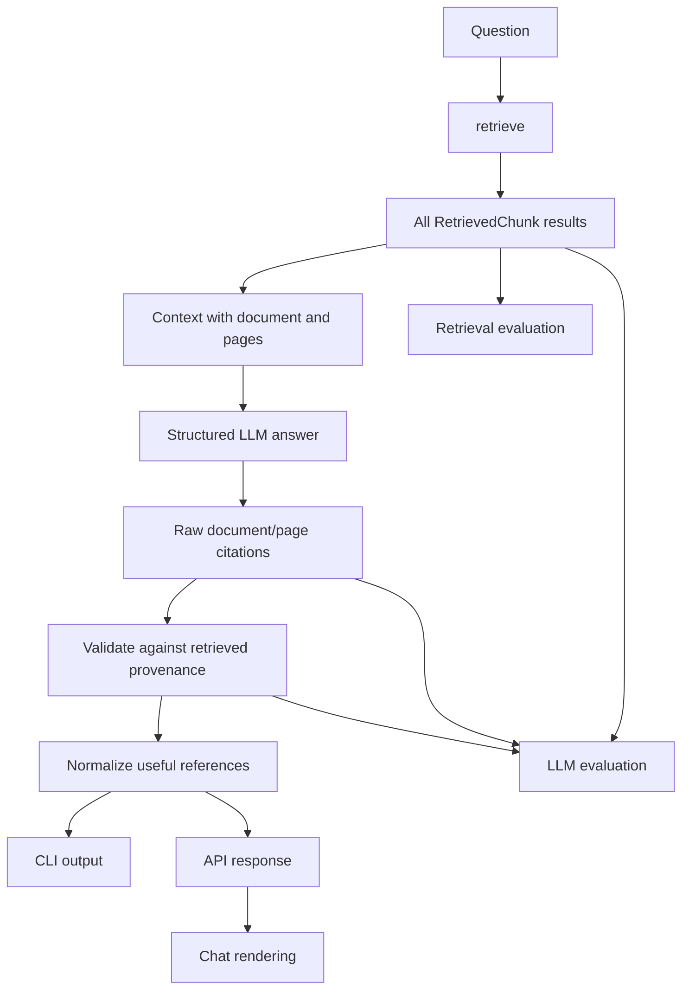

# Document/Page Source Tracking Implementation Plan

## Purpose

Refactor the AI Tour Guide RAG flow so retrieval, generation, presentation, and
evaluation use explicit and consistent source contracts.

The final behavior must be:

1. Search returns every ranked `RetrievedChunk` without presentation-level
   deduplication.
2. The LLM returns its answer and the document/page references that actually support it.
3. The RAG layer validates and normalizes those references once.
4. CLI and chat display only the validated, deduplicated useful references.
5. Retrieval and LLM evaluators retain the detailed intermediate results needed for
   document/page-based metrics and regression analysis.

This plan is written for implementation by an LLM coding agent against the current
branch of `QuentinElGuay/portfolio-ai-tour-guide`.

## Existing code to preserve and reuse

Reuse these existing types and functions wherever possible:

- `RetrievedChunk` and `SourceMetadata` in `ai_tour_guide.knowledge_base.retrieval`.
- `RAGResult` in `ai_tour_guide.agent.rag.models`.
- `answer_question()` in `ai_tour_guide.agent.rag.pipeline`.
- `build_context()` and `build_messages()` in `ai_tour_guide.agent.rag.prompting`.
- `format_page_range()` in `ai_tour_guide.agent.source_formatting`.
- `SourceResponse` and `AskResponse` in `ai_tour_guide.agent.api`.
- Existing CLI source rendering in `ai_tour_guide.agent.cli`.
- Existing page deduplication and `_format_pages()` behavior in
  `ai_tour_guide.agent.chat.backends`.
- Existing unit-test factories and fixtures in `tests/unit/ai_tour_guide/agent/`.

Do not duplicate retrieval models inside the agent or evaluation packages. Do not
reimplement source normalization separately for CLI, API, chat, or evaluation.

## Architectural decisions

### Evidence identity

Use a document identity plus a page range as the citation and evaluation unit.

Do not use the database-generated `document_id` as the evaluation identity because it
may change when a corpus is restored. The stable document identity should use a
combination of fields already present in `SourceMetadata` to identify the source in a
unique manner like `title`, `publisher`, `version`, `page_start` and `page_end`. Keep
`document_id` and `chunk_id` in detailed diagnostic results. They remain useful for
debugging retrieval behavior, but they are not the primary golden-dataset or LLM
citation contract.

### Three representations of sources

Keep these concepts separate:

1. **Retrieved chunks** — complete ranked `list[RetrievedChunk]` returned by search.
2. **LLM citations** — raw document/page claims returned by the LLM.
3. **Validated source references** — trusted, normalized references derived by comparing
   generated citations with retrieved provenance.

Only validated source references are displayed to users.

### Deduplication boundary

Do not deduplicate `RetrievedChunk` results by document or page. Multiple chunks from
the same page may contain different evidence and must remain visible to retrieval
evaluation and the LLM.

Deduplicate only validated useful references, in shared RAG source code, before
presentation.

## Target data flow



## Phase 1 — Add source and generation models

### Modify `src/ai_tour_guide/agent/rag/models.py`

Add an immutable raw citation model:

```python
@dataclass(frozen=True, slots=True)
class LLMCitation:
    source_url: str
    version: str | None
    page_start: int | None
    page_end: int | None
```

Add an immutable structured generation result:

```python
@dataclass(frozen=True, slots=True)
class GeneratedAnswer:
    answer: str
    citations: tuple[LLMCitation, ...]
```

Add an immutable trusted reference model:

```python
@dataclass(frozen=True, slots=True)
class SourceReference:
    source_url: str
    version: str | None
    title: str
    page_start: int | None
    page_end: int | None
```

Add a validation-result model holding valid and invalid citations. Prefer a small
dataclass instead of returning an unlabelled tuple.

Expand `RAGResult` while retaining convenient compatibility properties:

```python
@dataclass(frozen=True)
class RAGResult:
    generated: GeneratedAnswer
    retrieved: list[RetrievedChunk]
    sources: list[SourceReference]
    invalid_citations: list[LLMCitation]

    @property
    def answer(self) -> str:
        return self.generated.answer

    @property
    def chunks(self) -> list[DocumentChunkRow]:
        return [result.chunk for result in self.retrieved]
```

`sources` must mean validated, normalized useful sources. Use this same meaning in CLI
and API code.

### Acceptance criteria

- The complete ranked retrieval result remains present in `RAGResult.retrieved`.
- Raw LLM citations remain present in `RAGResult.generated.citations`.
- Invalid citations are observable and are not silently discarded.
- Existing callers can continue reading `result.answer` and, temporarily,
  `result.chunks`.

## Phase 2 — Generalize existing page formatting

### Modify `src/ai_tour_guide/agent/source_formatting.py`

Generalize `format_page_range()` so it can consume `DocumentChunkRow`, `SourceMetadata`,
`LLMCitation`, or `SourceReference` without duplicating implementations. Define a small
structural `Protocol` containing `page_start` and `page_end`, or accept those values
explicitly.

Move the useful behavior of the chat backend's `_format_pages()` into this module:

```python
def format_pages(pages: Sequence[int]) -> str:
    ...
```

Add a formatter for a trusted `SourceReference` only if CLI and chat can genuinely share
the same textual output. If their surrounding Markdown differs, share page formatting
and keep the small wrappers interface-specific.

### Acceptance criteria

- Existing singular/range behavior remains unchanged.
- Natural formatting for one, two, and three-or-more pages remains covered by tests.
- `chat.backends` no longer owns a duplicate page-list formatter.

## Phase 3 — Pass retrieved provenance to the prompt

### Modify `src/ai_tour_guide/agent/rag/prompting.py`

Change `build_context()` from:

```python
Sequence[DocumentChunkRow]
```

to:

```python
Sequence[RetrievedChunk]
```

Build every context block from the existing `RetrievedChunk.source` and
`RetrievedChunk.chunk` fields. Include at least:

- Exact `source_url`.
- Exact `version`, including an explicit representation when absent.
- Page or page range using the existing generalized `format_page_range()`.
- Title for readability.
- Section path when available.
- Chunk text.

Do not use chunk IDs as the requested citation format. It is acceptable to retain them
as diagnostic context if tests or troubleshooting benefit, but document/page provenance
must be sufficient for the model to cite correctly.

Update `SYSTEM_PROMPT` to require the LLM to:

- Answer only from supplied context.
- Return only sources that materially support the answer.
- Copy `source_url`, `version`, and page bounds exactly from the context.
- Return no citations when the answer is the insufficient-context response.
- Avoid automatically citing every retrieved source.

### Modify `src/ai_tour_guide/agent/rag/pipeline.py`

Pass `retrieved` directly to `build_context()` instead of constructing
`[result.chunk for result in retrieved]`.

### Acceptance criteria

- Every retrieved result appears in the prompt with document/page provenance.
- Multiple chunks on the same page remain separate context blocks.
- Tests assert the exact document identity and page values provided to the LLM.

## Phase 4 — Introduce structured LLM output

### Modify `src/ai_tour_guide/agent/llm/interfaces.py`

Change the RAG LLM protocol from returning `str` to returning `GeneratedAnswer`.

Avoid coupling the general chat UI protocol to RAG-specific structured output if it is
still used independently. If necessary, define a dedicated RAG generation protocol
rather than changing a broader conversation backend contract.

### Modify `src/ai_tour_guide/agent/llm/client.py`

Use provider-supported structured output so the model returns an answer and a list of
document/page citations matching the `GeneratedAnswer` schema.

Keep provider-specific response parsing in `OpenAIClient`. Return application models to
the pipeline; do not expose provider SDK response objects.

Reject malformed or empty structured answers with a clear `RuntimeError`, consistent
with current error handling.

Capture usage and latency later through the evaluation instrumentation layer; do not
make the user-facing source refactor depend on the experiment-tracker implementation.

### Acceptance criteria

- The LLM client returns `GeneratedAnswer`, never JSON text for downstream code to parse
  again.
- A valid answer may contain zero or more citations.
- Tests cover a valid structured response, empty answer, malformed response, and API
  failure.

## Phase 5 — Implement shared validation and normalization

### Add `src/ai_tour_guide/agent/rag/sources.py`

This module must be the only owner of useful-source validation and deduplication.

Implement:

```python
def validate_citations(
    citations: Sequence[LLMCitation],
    retrieved: Sequence[RetrievedChunk],
) -> CitationValidationResult:
    ...
```

Validation rules:

1. Match documents by `(source_url, version)`.
2. A cited page is valid only if it is covered by at least one retrieved range for that
   document.
3. Treat a missing `page_end` as a single-page citation when `page_start` exists.
4. Permit a page-less document citation only when matching retrieved provenance also
   lacks page information.
5. Record unknown documents and unsupported pages as invalid citations.
6. Never trust the LLM-provided title; recover the title from matching `SourceMetadata`.
7. Preserve invalid citations for evaluation and debugging, but never display them.

Implement normalization either inside validation or as a separate function:

```python
def normalize_source_references(
    references: Sequence[SourceReference],
) -> list[SourceReference]:
    ...
```

Normalization rules:

1. Group by `document_id` and `page_range`.
2. Deduplicate repeated pages.
3. Merge overlapping and directly adjacent page ranges into compact ranges.
4. Sort ranges by page number.
5. Keep different versions of the same URL separate.
6. Preserve one page-less reference when no page information exists.
7. Produce deterministic output ordering. Prefer first valid citation order for
   documents and ascending page order within each document.
8. Return `title`, `coolection` (if not null), `publisher` and `page`, not database ids.

Reuse the existing set-based page accumulation from `chat.backends._format_answer()` as
the starting point, but relocate it here and extend its identity and validation rules.

### Important range behavior

Do not validate a broad citation merely because its endpoints occur in retrieved
results. Every page in the cited range must be covered. For example, retrieved pages 2
and 4 do not justify a citation to pages 2–4 because page 3 was not supplied.

### Acceptance criteria

- Validation and normalization have no dependency on Click, FastAPI, Gradio, or HTTP
  payloads.
- The same inputs always produce the same ordered outputs.
- Unknown or unsupported citations remain available in `invalid_citations`.
- No interface contains its own source-deduplication algorithm afterward.

## Phase 6 — Assemble the detailed RAG result

### Modify `src/ai_tour_guide/agent/rag/pipeline.py`

Change `answer_question()` to:

1. Resolve the LLM client as it does today.
2. Retrieve and retain all ranked chunks.
3. Build context from all retrieved chunks.
4. Receive `GeneratedAnswer` from the LLM.
5. Validate the raw generated citations against `retrieved`.
6. Normalize the valid references.
7. Return the expanded `RAGResult`.

For no-client and no-retrieval cases, return a consistent `GeneratedAnswer` with no
citations, the appropriate existing answer constant, empty sources, and empty invalid
citations.

Do not hide citation validation failures by replacing the generated answer. The answer,
raw citations, valid sources, and invalid citations are separate evaluation signals.

### Acceptance criteria

- `answer_question()` is the common application entry point for CLI, API, and RAG
  evaluation.
- `RAGResult.retrieved` always contains the unmodified search output.
- `RAGResult.sources` contains only validated and normalized useful references.

## Phase 7 — Refactor interfaces to presentation only

### Modify `src/ai_tour_guide/agent/cli.py`

Keep `search_command()` behavior detailed and unchanged in principle:

- Print every result.
- Preserve chunk ID, rank, score, score kind, page range, and chunk text.
- Do not deduplicate results.

Change `ask_command()` to:

- Print `result.answer`.
- Iterate over `result.sources`.
- Use shared functions from `source_formatting.py`.
- Remove its current grouping, sorting, and duplicate-range checks.

### Modify `src/ai_tour_guide/agent/api.py`

Make `/ask` serialize `result.sources`, never `result.retrieved`.

Extend `SourceResponse` to include stable identity:

```python
class SourceResponse(BaseModel):
    source_url: str
    version: str | None
    title: str
    page_start: int | None
    page_end: int | None
```

The public response should contain the answer and only deduplicated useful sources.
Detailed retrieval data remains available to evaluation through direct application calls
rather than being added to the normal chat response.

### Modify `src/ai_tour_guide/agent/chat/backends.py`

Remove source grouping and set-based deduplication from `_format_answer()`.

The HTTP chat backend should only:

- Validate the response shape.
- Format the already-normalized source records returned by the API.
- Append the Markdown source section.

Reuse `format_page_range()` or `format_pages()` from `source_formatting.py`. Delete the
local `_format_pages()` if no longer needed.

### Acceptance criteria

- CLI and chat display the same useful document/page references for the same
  `RAGResult`.
- Retrieved but uncited sources do not appear in `ask` output.
- API and chat perform no source selection or deduplication.

## Phase 8 — Update retrieval evaluation

Keep retrieval evaluation separate from pytest and from RAG/LLM evaluation.

The retrieval evaluator should call `retrieve()` directly. For each golden-dataset
example, retain every returned `RetrievedChunk` with:

- `source_url` and `version` as stable document identity.
- `page_start` and `page_end`.
- Rank, score, and score kind.
- `document_id`, `chunk_id`, section path, and content hash as diagnostic fields where
  available.
- Retrieval latency.

Define golden relevance using document/page references, for example:

```json
{
  "question": "When does the museum open?",
  "relevant_sources": [
    {
      "source_url": "https://example.com/museum.pdf",
      "version": "2026",
      "page_start": 12,
      "page_end": 12
    }
  ]
}
```

Calculate separate metrics where useful:

- Document hit rate and recall at K.
- Document/page hit rate and recall at K.
- MRR using the first result whose document/page coverage matches expected evidence.
- Latency.

Do not normalize or deduplicate the ranked retrieval list before calculating rank-based
metrics.

## Phase 9 — Update RAG/LLM evaluation

The RAG evaluator should call `answer_question()` and retain, per example:

- Question and reference answer.
- Full ranked `RAGResult.retrieved` data.
- Generated answer.
- Raw `LLMCitation` values.
- Validated, normalized `RAGResult.sources`.
- `RAGResult.invalid_citations`.
- Expected document/page evidence.
- Model, prompt, and retrieval configuration.
- Latency, token usage, errors, and scorer outputs when instrumentation is available.

Support metrics including:

- Answer correctness.
- Groundedness.
- Citation precision against expected document/pages.
- Citation recall against expected document/pages.
- Invalid-document citation rate.
- Invalid-page citation rate.
- Refusal quality.

Persist aggregate and per-example results through the planned experiment tracker in
PostgreSQL's `evaluation` schema. Evaluation tables must be created through the shared
database initialization process using the explicit evaluation profile; runners must not
create their own DDL.

## Phase 10 — Tests

Update the existing tests rather than creating parallel test structures.

### `tests/unit/ai_tour_guide/agent/test_rag.py`

Cover:

- Prompt contains document URL, version, title, section, and pages.
- All retrieved chunks are passed to the prompt.
- Structured answer is preserved.
- Raw, valid, normalized, and invalid citations are distinguishable.
- No-retrieval and no-client cases return consistent empty citation collections.

### Add or extend source-focused unit tests

Prefer a focused test module such as `test_rag_sources.py` if `test_rag.py` becomes
difficult to navigate.

Cover:

- Repeated citations deduplicate.
- Overlapping and adjacent ranges merge.
- Disjoint ranges remain distinct.
- Same title with different URLs remains separate.
- Same URL with different versions remains separate.
- Unknown URL is invalid.
- Known document with an unsupported page is invalid.
- A range with an uncovered internal page is invalid.
- Page-less references follow the explicit validation rule.
- Ordering is deterministic.

### `tests/unit/ai_tour_guide/agent/test_cli.py`

Cover:

- `search` prints every retrieved chunk, including same-page chunks.
- `ask` prints only `RAGResult.sources`.
- CLI no longer independently deduplicates references.

### `tests/unit/ai_tour_guide/agent/test_api.py`

Cover:

- API returns only normalized useful sources.
- Stable identity fields are present.
- Retrieved-but-unused sources are absent.

### `tests/unit/ai_tour_guide/agent/test_chat_backends.py`

Cover:

- Chat formats API sources without changing their membership.
- Page text formatting remains correct.
- The test should no longer claim that the chat backend deduplicates sources.

### `tests/unit/ai_tour_guide/agent/test_llm.py`

Cover structured-output parsing and provider errors.

## Suggested implementation sequence

Execute the work in small, testable commits:

01. Generalize existing page formatting and update its tests.
02. Add source and structured-generation models.
03. Add shared citation validation and normalization with exhaustive unit tests.
04. Change prompting to consume `RetrievedChunk` and expose document/page provenance.
05. Implement structured LLM output.
06. Expand `RAGResult` and update `answer_question()`.
07. Refactor CLI to consume normalized sources.
08. Refactor API to expose normalized sources.
09. Simplify chat to presentation-only formatting.
10. Update all affected unit and API contract tests.
11. Wire complete retrieval results into the separate retrieval evaluator.
12. Wire detailed RAG results into the separate LLM evaluator and experiment
    persistence.

Run focused tests after each step, followed by the complete test suite in the project's
quality/test container.

## Non-goals

- Do not change search ranking or hybrid fusion behavior.
- Do not deduplicate retrieved chunks by page.
- Do not make chunk IDs the golden-dataset relevance contract.
- Do not expose the full retrieval trace in the normal public `/ask` response.
- Do not implement separate source rules in CLI, API, chat, and evaluation.
- Do not create evaluation tables outside the existing shared database initialization
  process.
- Do not convert standalone evaluations into pytest tests.

## Completion checklist

- [ ] Search returns and exposes every ranked `RetrievedChunk`.
- [ ] Prompt includes document/page provenance for every retrieved chunk.
- [ ] LLM returns a structured answer with document/page citations.
- [ ] Citation validation rejects unsupported documents and pages.
- [ ] Source normalization is implemented once in shared RAG code.
- [ ] CLI `ask` shows only validated, deduplicated useful sources.
- [ ] API returns only validated, deduplicated useful sources.
- [ ] Chat formats API sources without re-deduplicating them.
- [ ] Retrieval evaluation retains the complete ranked result list.
- [ ] LLM evaluation retains answer, retrieval trace, raw citations, valid sources, and
  invalid citations.
- [ ] Golden relevance is document/page based.
- [ ] Existing shared types and formatting code are reused.
- [ ] Focused tests and the complete suite pass in the container.

## Final acceptance scenario

Given five retrieved chunks where:

- Three chunks come from document A, pages 10–11.
- One chunk comes from document A, page 15.
- One chunk comes from document B, page 3.
- The LLM uses only evidence from document A pages 10–11 and repeats that citation
  twice.

The system must produce:

- Retrieval detail containing all five ranked chunks.
- Raw generated citations containing both repeated document A citations.
- Valid normalized sources containing document A pages 10–11 once.
- No document B source in CLI, API, or chat output.
- Retrieval evaluation access to all five ranked results.
- LLM evaluation access to the answer, all five results, both raw citations, the one
  normalized source, and any invalid citations.
