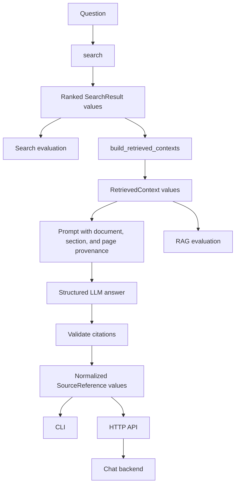

# Document and source tracking

This document describes the current source-tracking architecture and the remaining work
around evaluation. It replaces the original migration plan, which described contracts
that no longer exist.

## Current architecture

The knowledge base exposes two deliberately different representations:

1. `SearchResult` — one raw, ranked search hit with its score, rank, document, chunk,
   section path, and page range.
2. `RetrievedContext` — one document section expanded with sibling chunks for the LLM.
   It retains the contributing `SearchResult` values in `search_results`.



## Source and citation contracts

### Search results

`SearchResult` is the raw ranking contract used by vector, text, and hybrid search. It
contains:

- rank, score, and score kind;
- the matched `DocumentChunkRow`;
- the associated `DocumentRow`;
- section identity and section path;
- page start and end values.

Search evaluation operates directly on these values and does not construct
`RetrievedContext` objects.

### Retrieved contexts

`RetrievedContext` represents the context supplied to the LLM. It stores:

- the source document;
- `section_id`;
- the full `section_path`;
- sibling `context_chunks` in reading order;
- the contributing `search_results`.

Context expansion may group multiple search hits from the same document section. This
grouping is appropriate for prompt construction, but must not replace raw search results
in search evaluation.

### Generated answers and sources

The LLM returns a `GeneratedAnswer` containing:

- the answer text;
- raw `LLMCitation` values;
- optional provider metadata and the raw provider response.

The RAG layer validates those citations against retrieved contexts and produces:

- valid, normalized `SourceReference` values for presentation;
- preserved invalid citations for diagnostics and evaluation.

Only validated `SourceReference` values are exposed by the CLI, API, and chat output.

## Current citation behavior

Citation validation is centralized in `agent/rag/sources.py` and currently:

- matches documents by `(source_url, version)`;
- validates cited pages against retrieved context pages;
- rejects unknown documents and unsupported pages;
- handles page-less citations explicitly;
- preserves invalid citations;
- deduplicates and normalizes valid references;
- keeps different document versions separate;
- produces deterministic source ordering.

Page ranges remain important for LLM citation validation and public source responses.
They are not used by the current search-evaluation golden dataset.

## Search evaluation

The search evaluator lives in `evaluation/search/` and is run with:

```bash
make evaluate EVALUATION=retrieval
```

The Make target name remains compatible, but the evaluator itself is called “search
evaluation” because it measures raw search rankings.

For every golden case and search mode, it:

- calls `search()` directly;
- retains the ordered raw `SearchResult` list;
- records diagnostic chunk IDs;
- derives one section-evidence key per raw ranked chunk;
- computes hit rate, recall, and reciprocal rank;
- evaluates the first configured `K` raw chunks without section deduplication;
- reuses one database engine and search strategy per mode, so latency excludes setup;
- records the active strategy and embedding/hybrid configuration in the report;
- reports aggregate metrics only;
- displays progress with `tqdm`.

The golden dataset is section-based. Each relevant source contains:

```json
{
  "source_url": "https://example.com/guide.pdf",
  "version": null,
  "section_path": [
    "guide-to-the-region-of-brittany",
    "activities-and-things-to-do",
    "top-attractions-in-brittany"
  ]
}
```

The final heading is excluded from the expected path and titles are slugified before
comparison. Pages are intentionally absent from this dataset.

## Remaining work

### Implement the RAG evaluator

`evaluation/rag/run.py` is still a stub. It should:

- call `answer_question()` for each golden case;
- display progress with `tqdm`;
- retain the answer, contexts, raw citations, valid sources, invalid citations, errors,
  timing, and model metadata;
- calculate aggregate results;
- avoid changing the normal CLI/API response contract.

`evaluation/rag/metrics.py` should be implemented after the per-case result contract is
defined. Candidate metrics include answer correctness, citation validity, citation
precision/recall, and refusal quality.

### Complete agent tests

The agent test suite still contains placeholder tests and incomplete fixtures, notably
in:

- `tests/unit/ai_tour_guide/agent/test_cli.py`;
- `tests/unit/ai_tour_guide/agent/test_rag.py`;
- `tests/unit/ai_tour_guide/agent/test_api.py`.

Replace unconditional assertions and stale fixtures with tests for the current
`SearchResult`, `RetrievedContext`, `RAGResult`, and `SourceReference` contracts.

### Optional evaluation persistence

If experiment tracking becomes a project requirement, add evaluation result models and
persist them in the `evaluation` database schema through the shared database
initialization process. This is not required for the current search-evaluation CLI.

## Completion criteria

- [x] Raw search and expanded LLM context are separate contracts.
- [x] `RetrievedContext` retains its contributing `SearchResult` values.
- [x] Prompt construction includes document, section, and page provenance.
- [x] LLM output is structured as `GeneratedAnswer`.
- [x] Citation validation and source normalization are centralized.
- [x] CLI, API, and chat consume normalized sources without reselecting them.
- [x] Search evaluation uses raw `SearchResult` values.
- [x] Search evaluation uses slugified section paths and no pages.
- [ ] RAG evaluation runner is implemented.
- [ ] Placeholder agent tests are replaced with real assertions.
- [ ] Full test suite passes without incomplete skeleton tests.
